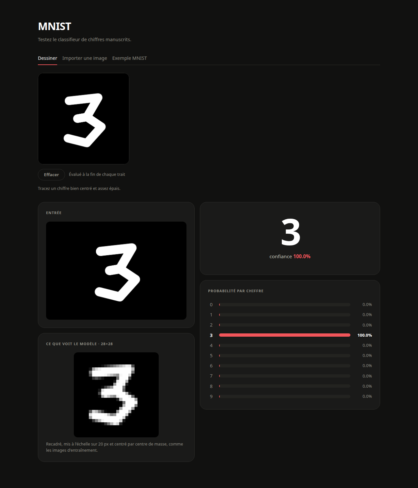

# Classifieur de chiffres manuscrits MNIST

Un réseau de neurones Keras entraîné sur MNIST, servi par une API FastAPI et
piloté depuis une interface React — le tout orchestré par Docker Compose.



## Architecture

Trois services, dont un ponctuel :

| Service | Rôle | Technologie | Port |
|---|---|---|---|
| `web` | Interface : dessin, import, exemples | React + Tailwind, servi par nginx | `8080` |
| `api` | Prétraitement et inférence | FastAPI + TensorFlow | `8000` |
| `training` | Entraîne le modèle, ponctuel | TensorFlow + `tensorflow-datasets` | — |

Le navigateur n'appelle jamais l'API directement : nginx expose `/api/` sur la
même origine et relaie vers `api:8000`. Aucun CORS en production.

Les deux services durables ne partagent **aucun état** : ils communiquent par
HTTP, et le modèle transite par le volume `./models`, écrit par `training` et
monté en lecture seule par `api`. Réentraîner ne demande donc aucune
reconstruction d'image.

```
navigateur ──▶ web (nginx) ──/api/──▶ api (FastAPI) ──▶ ./models ◀── training
```

## Démarrage

```bash
# 1. Entraîner le modèle (une fois, ~5 min sur CPU)
docker compose run --rm training

# 2. Lancer l'application
docker compose up --build
```

L'interface est sur <http://localhost:8080>, la documentation OpenAPI
interactive sur <http://localhost:8000/docs>.

Tant que `models/` est vide, l'API répond `503` et l'interface affiche
l'erreur : lancez l'étape 1 d'abord.

## API

| Méthode | Route | Corps | Réponse |
|---|---|---|---|
| `GET` | `/health` | — | État du service et présence du modèle |
| `POST` | `/predict` | `multipart/form-data`, champ `file` | `Prediction` |
| `POST` | `/predict/data-url` | `{"image": "data:image/png;base64,…"}` | `Prediction` |
| `GET` | `/samples/random` | — | Un chiffre du jeu de test et son étiquette |

`Prediction` contient le chiffre prédit, sa confiance, les dix probabilités, et
`preview` — l'image 28×28 réellement reçue par le modèle, en data URI. C'est la
vue la plus utile pour comprendre une erreur de prédiction.

```bash
curl -F "file=@chiffre.png" http://localhost:8000/predict
```

Codes d'erreur : `400` image illisible, `413` au-delà de 8 Mo, `422` aucun
chiffre détecté, `503` modèle absent.

## Développement hors Docker

```bash
# API
python -m venv .venv && source .venv/bin/activate
pip install -r backend/requirements.txt
MODEL_PATH=models/mnist_classifier.keras SAMPLES_PATH=models/samples.npz \
  uvicorn backend.app.main:app --reload

# Interface (proxy /api vers 127.0.0.1:8000, voir vite.config.js)
cd frontend && npm install && npm run dev
```

Pour entraîner sans Docker :

```bash
pip install -r training/requirements.txt
cd training && python train.py --out ../models
```

## Fonctionnement

### Le prétraitement

C'est ce qui fait la différence entre une bonne et une mauvaise prédiction sur
une image réelle. `backend/app/preprocessing.py` reproduit la normalisation
d'origine de MNIST :

1. **Détection de polarité** — la médiane des pixels de bordure indique si
   l'encre est sombre sur fond clair ou l'inverse. Les deux cas fonctionnent.
2. **Seuillage d'Otsu**, puis sélection du plus grand contour externe.
3. **Recadrage sur l'encre en niveaux de gris** (et non sur le masque binaire) :
   la réduction en `INTER_AREA` produit ainsi les bords adoucis que le modèle a
   vus à l'entraînement.
4. **Mise à l'échelle** dans une boîte de 20 px, rapport d'aspect préservé.
5. **Centrage par centre de masse** dans un canevas de 28×28 — c'est ainsi que
   MNIST a été construit, et non par centre de la boîte englobante.

### Le modèle

```
Input(28, 28, 1) → Flatten → Dense(128, relu) → Dense(10)
```

101 770 paramètres, Adam (`1e-3`), 6 époques, lots de 128, **≈ 97,6 %**
d'exactitude en validation.

> [!IMPORTANT]
> La dernière couche produit des **logits**, pas des probabilités (entraînement
> avec `from_logits=True`). `inference.classify()` applique la softmax — faites
> de même si vous chargez `mnist_classifier.keras` vous-même, sinon les valeurs
> lues comme « confiance » n'auront aucun sens.

## Structure

```
backend/app/    FastAPI : routes, prétraitement, inférence, exemples
frontend/src/   React : App, DrawPad, ResultPanel, ProbabilityBars
training/       Entraînement et export des artefacts
models/         mnist_classifier.keras + samples.npz (produits, non versionnés)
```

### Deux points à connaître

- **`importlib_resources` est épinglé explicitement.** `tensorflow-datasets`
  l'importe paresseusement : pip ne le résout pas comme dépendance transitive
  et `pip check` ne signale rien. L'erreur n'apparaît qu'en plein
  téléchargement du jeu de données.
- **Les exemples MNIST sont figés à l'entraînement**, dans `samples.npz`.
  L'API sert ainsi l'onglet « Exemple » sans embarquer
  `tensorflow-datasets` ni accéder au réseau.
